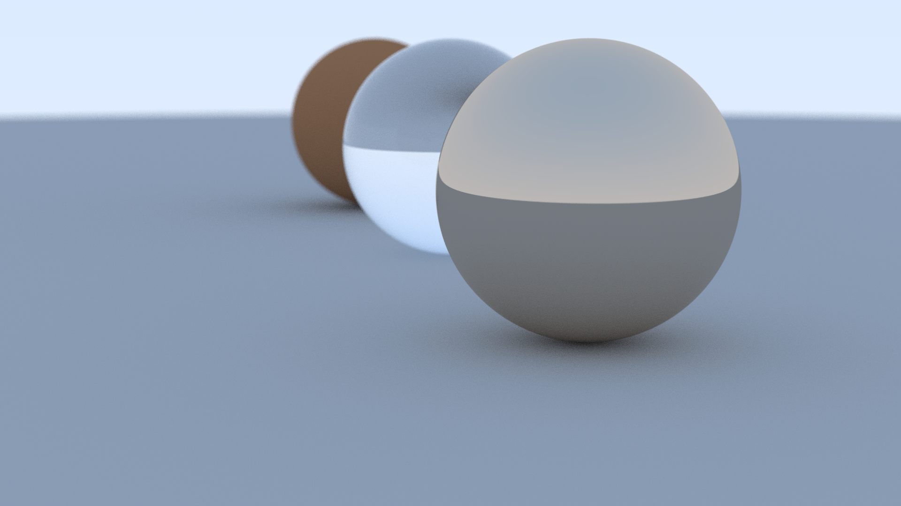
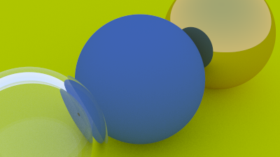

# C++ Raytracer | cpp-raytracer

## Overview
This is a raytracer written in C++ following the Ray tracing in one weekend book. The purpose of thie project is to generate realistic images by simulating shadows, reflection, refraction and many other natural phenomenon. I also wanted to use linear algebra, so I worked on this personal project.

## Homepage
[https://github.com/ananthvk/cpp-raytracer](https://github.com/ananthvk/cpp-raytracer)

## Features
* Shadows, diffuse materials
* Reflections, metals, refractions and glass
* Simple geometric shapes such as spheres
* Anti-aliasing
* Multithreading

## Getting started
### Requirements
1. A C++ 11 compiler, (GCC, MSVC, etc)
2. CMake >= 3.10
3. Git (optional)

You can install the packages on linux using your preferred package manager.
For example on ubuntu,
```
sudo apt update
sudo apt install build-essential cmake
```
On windows, install mingw and cmake.

### Building
Get the sources
```
git clone https://github.com/ananthvk/cpp-raytracer.git
```
Otherwise you can also download the source directly from github.
#### Build the project
```
cd cpp-raytracer
mkdir build
cd build
cmake ..
```
#### On linux based systems
```
make
```
Then run the application with
```
./raytracer
```
#### On windows
On windows, open the project in MSVC and build the project.
Or you can also install mingw and use gcc for compilation.
Run the generated executable.

## Project structure
A list of files in `src` directory with a short description.
|File|Description|
|-----|---------------|
|[camera.cpp](src/camera.cpp) and [camera.hpp](src/camera.hpp)|Has the camera class, which produces rays cast into the scene|
|[colors.hpp](src/colors.hpp)|Defines color types, lerp for color, common colors and gamma correction.|
|[commons.hpp](src/commons.hpp)|Common functions - random number functions, intersection, interaction structs|
|[config.hpp](src/config.hpp)|Default configuration for the raytracer|
|[frombook.hpp](src/frombook.hpp)|Methods copied from book to test a particular functionality|
|[image.hpp](src/image.hpp) and image.cpp|Functions for writing the image to a file|
|[main.cpp](src/main.cpp)|Entry point for the program, `main` function|
|[material.hpp](src/material.hpp) and [material.cpp](src/material.cpp)|Material class and defines various materials such as lambertian, glass, and metals.|
|[objects.hpp](src/objects.hpp) and [objects.cpp](src/objects.cpp)|Different objects used in raytracing - spheres|
|[progressbar.hpp](src/progressbar.hpp)|Functions to display progressbar on the console|
|[raytracer.hpp](src/raytracer.hpp) and [raytracer.cpp](src/raytracer.cpp)|Single threaded and multi threaded raytracer class and functions. They perform the main task of raytracing|
|[scene.hpp](src/scene.hpp) and [scene.cpp](src/scene.cpp)|Defines the scene to be used for raytracing.|


## Sample renders




## License
This project is licensed under the MIT License - see the [LICENSE](LICENSE) file for details.

## Credits
* `stb_image_write.h` and `stb_image.h` for writing images - [https://github.com/nothings/stb/](https://github.com/nothings/stb/)
* `linalg.h` for vectors -  [https://github.com/sgorsten/linalg](https://github.com/sgorsten/linalg)

## References
[https://raytracing.github.io/books/RayTracingInOneWeekend.html](https://raytracing.github.io/books/RayTracingInOneWeekend.html)
